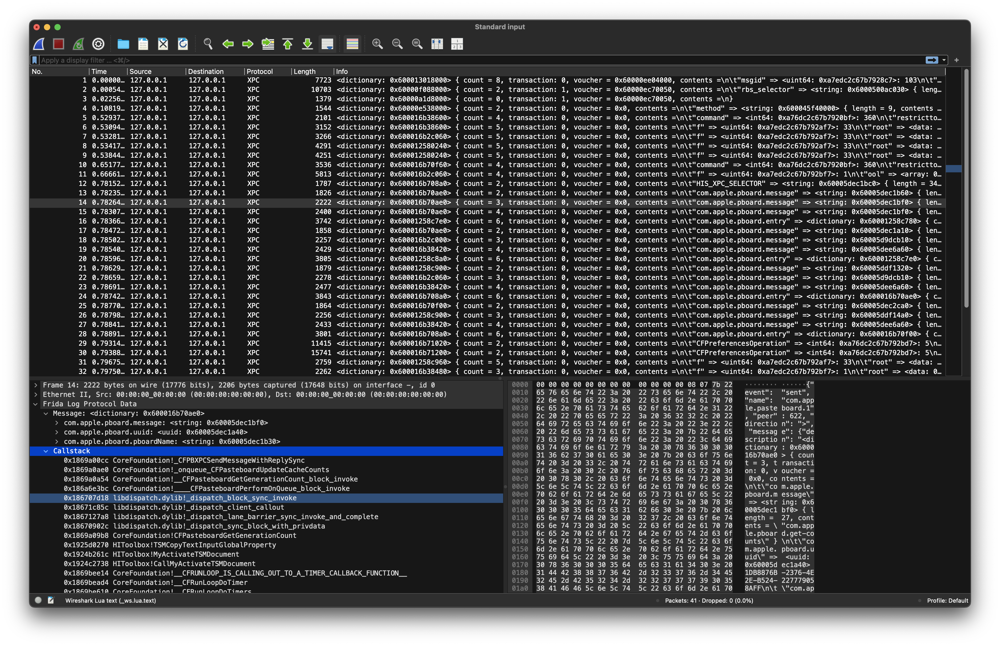

# XpcScope

Yet another xpc sniffer

## dependencies

Written in python, should support Windows and Linux as well.

* python >=3.10

Here is the setup instructions on macOS.

```shell
brew install python3                # requires python >=3.10
python3 -m vent env                 # initialize virtual environment
source env/bin/activate             # active venv shell
pip install -e .                    # install all dependencies
```

Build frida agent:

```shell
make prepare

# on Windows or systems without make, manually the commands in Makefile
# frida-compile src\frida\agent\index.ts > src\frida\_agent.js
# pyside6-rcc -o src/xpcscope/res.py assets/resources.qrc
```

## Run

I am too lazy to adapt the cli options from frida, so simply write your attach logic in `target.py` in current directory.

An example script is provided in `target.example.py`

```shell
python3 bin/xpcscope target.example.py
```



## Trouble Shooting

### ModuleNotFoundError: No module named 'xpcscope'

```shell
export PYTHONPATH=src
```

